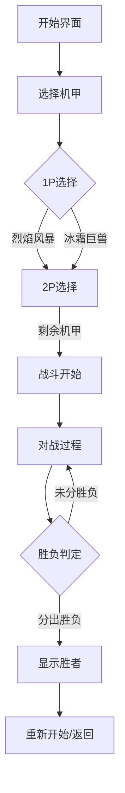
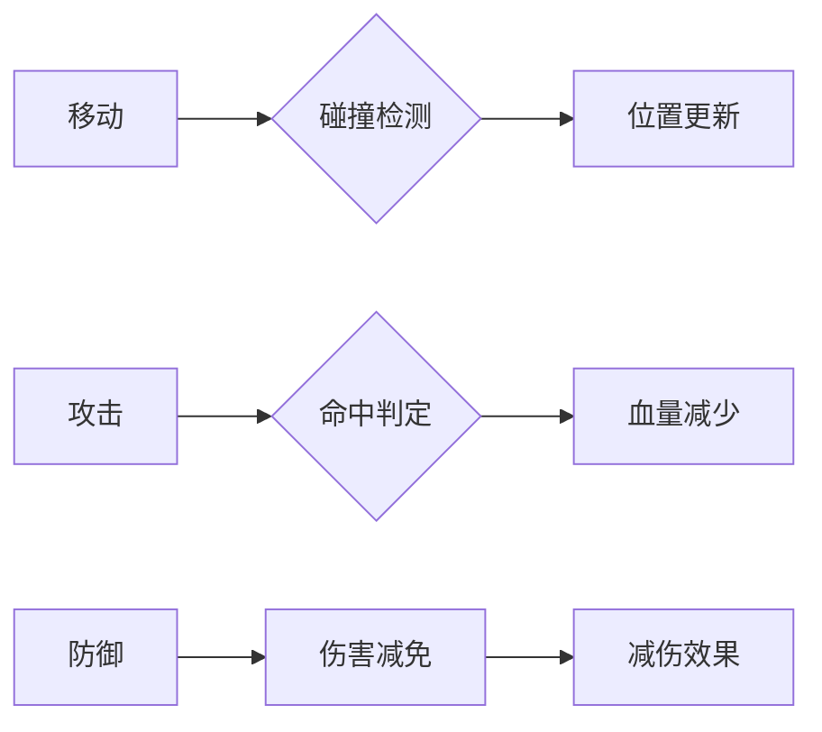

# 像素风机甲对战游戏 - 产品需求文档

## 1. 产品概述

一款双人对战的像素风格机甲格斗游戏。两名玩家各自控制一台机甲，在复古赛博朋克风格的战斗场景中进行激烈对抗。游戏强调操作技巧与策略搭配，支持移动、攻击、防御等基本战斗操作，配合像素动画与特效呈现热血对战场面。

- **核心目标用户**: 休闲游戏玩家、格斗游戏爱好者、像素风格粉丝
- **产品价值**: 提供即开即玩的双人本地对战体验，重温经典格斗游戏的乐趣

---

## 2. 核心功能

### 2.1 游戏角色

| 角色 | 名称 | 特点 | 配色 |
|------|------|------|------|
| 机甲A | 烈焰风暴 | 攻击力高、防御较低 | 红/橙 |
| 机甲B | 冰霜巨兽 | 攻击力中等、防御较高 | 蓝/青 |

### 2.2 功能模块

1. **战斗场景** - 像素风格室内竞技场，带有金属质感的地面与背景
2. **机甲控制** - 玩家1使用键盘WASD移动，J/K攻击防御；玩家2使用方向键移动
3. **血量系统** - 每台机甲100点HP，生命值归零判负
4. **胜负判定** - 率先将对方血量降至0的选手获胜

---

## 3. 核心流程

### 3.1 游戏主流程

### 3.2 战斗操作流程

---

## 4. 用户界面设计

### 4.1 视觉风格

- **美术风格**: 16-bit像素艺术，赛博朋克工业风
- **主色调**: 深色背景 (#0a0a0f) + 霓虹色点缀
- **字体**: 像素风格等宽字体 (Press Start 2P)
- **特效**: 扫描线、像素颗粒感、霓虹光晕

### 4.2 页面结构

| 页面 | 模块 | 描述 |
|------|------|------|
| 开始界面 | 标题动画 | 闪烁的像素标题 + 开始提示 |
| 角色选择 | 机甲展示 | 两台机甲像素图 + 简单属性 |
| 战斗界面 | 战场 | 中央战斗区域 + 底部血条 |
| 结果界面 | 胜者展示 | 胜利动画 + 重新开始按钮 |

### 4.3 响应式设计

- 桌面优先，支持最小宽度800px
- 键盘操作，不涉及移动端触控

---

## 5. 像素素材方案

### 5.1 机甲精灵图

使用Canvas程序化生成的像素机甲，包含以下动画帧：
- 待机帧 (2帧循环)
- 行走帧 (4帧循环)
- 攻击帧 (3帧)
- 防御帧 (2帧)
- 受伤帧 (2帧)
- 胜利帧 (1帧)

### 5.2 场景素材

- 竞技场地面: 金属网格纹理
- 背景: 工业管道 + 霓虹灯管
- 粒子特效: 攻击火花、防御光盾

---

## 6. 游戏平衡性

| 属性 | 烈焰风暴 | 冰霜巨兽 |
|------|----------|----------|
| 生命值 | 100 | 120 |
| 攻击力 | 25 | 18 |
| 防御力 | 10% | 25% |
| 移动速度 | 5 | 4 |
| 攻击间隔 | 800ms | 1000ms |
| 防御减伤 | 30% | 50% |
