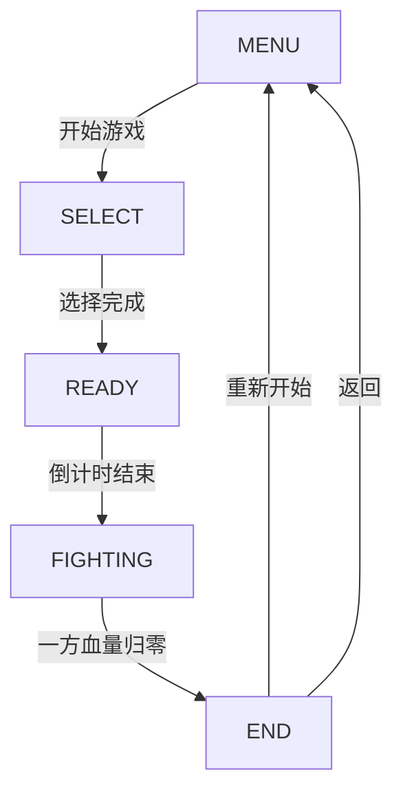

# 像素风机甲对战游戏 - 技术架构文档

## 1. 架构设计

```
┌─────────────────────────────────────────────────────────┐
│                      游戏主循环                          │
│  ┌─────────┐  ┌─────────┐  ┌─────────┐  ┌─────────┐    │
│  │ 输入处理 │→│ 状态更新 │→│ 碰撞检测 │→│ 渲染绘制 │    │
│  └─────────┘  └─────────┘  └─────────┘  └─────────┘    │
└─────────────────────────────────────────────────────────┘
```

## 2. 技术选型

- **前端**: 纯HTML5 + Canvas + 原生JavaScript
- **渲染**: Canvas 2D Context
- **动画**: requestAnimationFrame 60fps
- **无外部依赖**: 不使用任何框架，确保即开即用

## 3. 核心模块

### 3.1 模块划分

| 模块 | 职责 | 核心类/函数 |
|------|------|-------------|
| 游戏主控 | 状态管理、循环控制 | Game |
| 角色系统 | 机甲属性、动画、状态 | Mech |
| 战斗系统 | 攻击判定、伤害计算 | Combat |
| 输入系统 | 键盘事件处理 | InputHandler |
| 渲染系统 | 精灵绘制、特效 | Renderer |
| UI系统 | 血条、标题、按钮 | UI |

### 3.2 文件结构

```
/workspace/
├── index.html          # 游戏入口
├── css/
│   └── style.css       # 样式文件
├── js/
│   ├── main.js         # 游戏主入口
│   ├── game.js         # 游戏主循环
│   ├── mech.js         # 机甲类
│   ├── combat.js       # 战斗系统
│   ├── input.js        # 输入处理
│   ├── renderer.js     # 渲染器
│   ├── ui.js           # UI组件
│   └── sprites.js      # 像素精灵生成
└── assets/             # 静态资源(可选)
```

## 4. 游戏状态机



### 状态说明

| 状态 | 描述 | 渲染内容 |
|------|------|----------|
| MENU | 开始菜单 | 标题、开始提示 |
| SELECT | 角色选择 | 两台机甲展示 |
| READY | 战斗准备 | 倒计时 |
| FIGHTING | 战斗中 | 战场、对战 |
| END | 战斗结束 | 胜者、重新开始 |

## 5. 机甲数据模型

```javascript
// 机甲属性
{
  id: string,
  name: string,
  x: number,           // 位置X
  y: number,           // 位置Y
  hp: number,          // 当前血量
  maxHp: number,       // 最大血量
  attack: number,      // 攻击力
  defense: number,     // 防御率
  speed: number,       // 移动速度
  state: 'idle' | 'walk' | 'attack' | 'defend' | 'hurt' | 'victory',
  facing: 'left' | 'right',
  attackCooldown: number,
  isDefending: boolean
}
```

## 6. 碰撞检测

使用AABB矩形碰撞检测：
- 攻击范围检测: 攻击方位置 + 攻击距离
- 命中判定: 攻击范围 与 目标身体区域重叠

## 7. 像素精灵生成方案

使用Canvas绘制程序化像素精灵：

```javascript
// 机甲由多个像素块组成
// 头部: 8x8 像素块
// 身体: 12x16 像素块
// 手臂: 4x12 像素块 x2
// 腿部: 6x16 像素块 x2

// 颜色使用调色板
const palette = {
  primary: '#FF6B35',   // 红橙
  secondary: '#00D4AA', // 青蓝
  dark: '#1A1A2E',
  highlight: '#FFFFFF'
};
```

## 8. 音效方案 (可选扩展)

使用Web Audio API生成8-bit风格音效：
- 攻击音效: 短促的电子脉冲
- 防御音效: 低沉的金属碰撞
- 受伤音效: 电子杂音
- 胜利音效: 上升旋律

---

## 9. 性能目标

- 稳定60 FPS
- 首次加载 < 1秒
- 响应延迟 < 16ms
